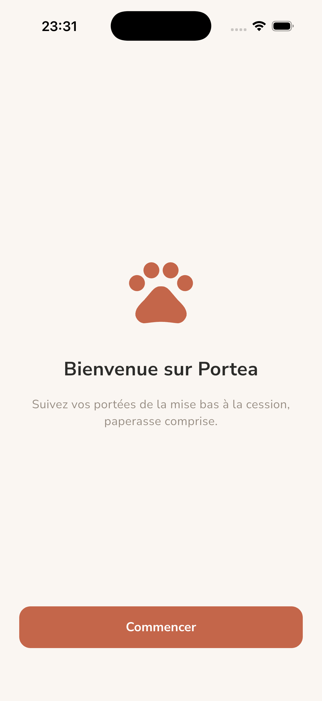
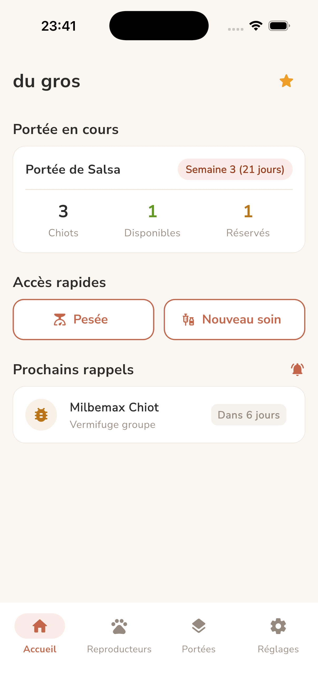
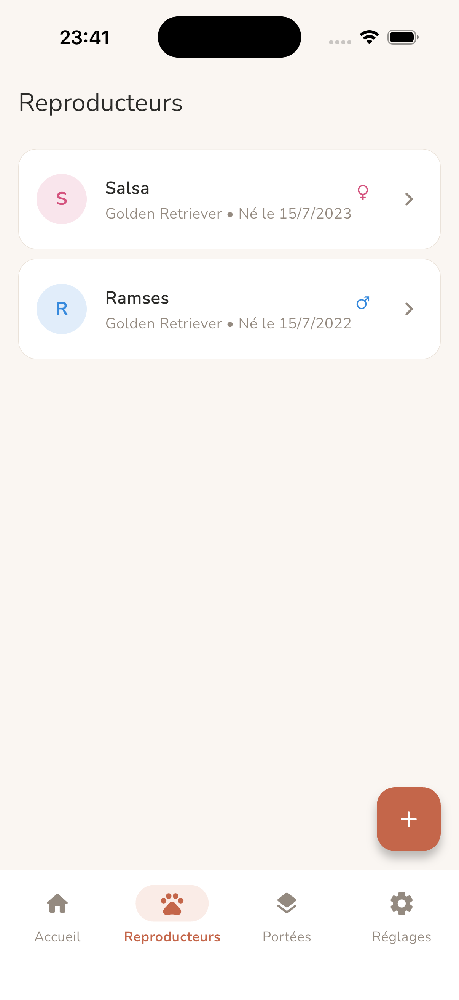
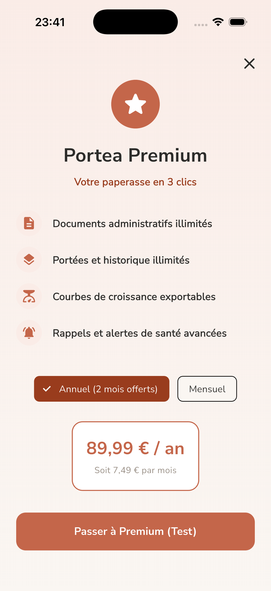
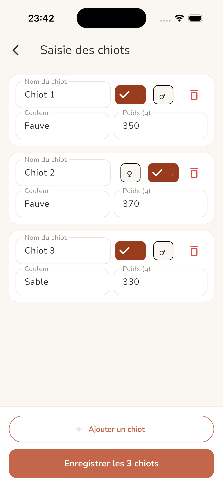
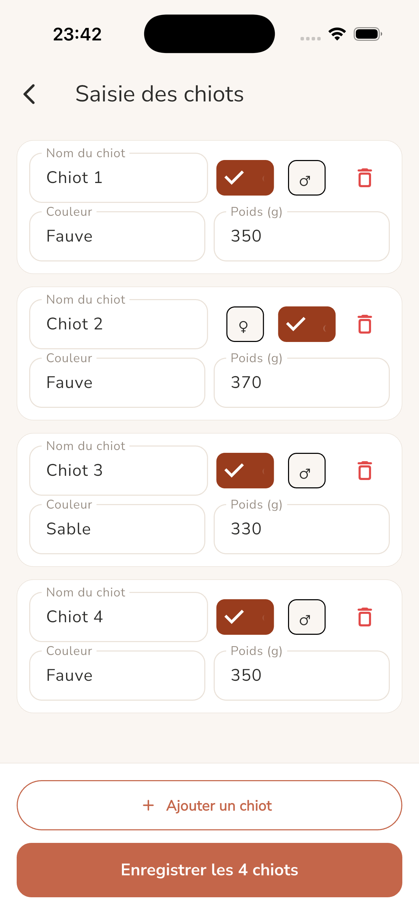

# Portea

Application mobile de gestion d'élevage pour éleveurs familiaux de chiens et
de chats. Portea centralise le suivi des portées, des reproducteurs, de la
croissance et des soins, ainsi que la production des documents légaux liés
à la cession d'un animal (attestation, certificat). Le modèle économique
est freemium : les fonctionnalités de base sont gratuites, l'édition de
documents et les options avancées relèvent d'un abonnement.

Ce dépôt contient le client Flutter. Le backend Serverpod et le client
généré vivent dans des dépôts séparés (voir *Monorepo* ci-dessous).

---

## Stack

- **Flutter** 3.38 (Dart 3.10), **Clean Architecture** + pattern **MVVM**,
  injection de dépendances et état via **Provider**.
- **go_router** pour le routage déclaratif (redirection d'onboarding,
  navigation par onglets via `ShellRoute`).
- **Serverpod 4.0.0-beta** : backend en Dart, PostgreSQL,
  authentification intégrée (email), WebSocket typés.
- **RevenueCat** : prévu pour la gestion d'abonnement (non intégré à ce
  stade).

### Monorepo

Le projet est organisé en trois packages :

| Dépôt            | Rôle                                               |
|------------------|----------------------------------------------------|
| `portea_flutter` | Application Flutter (ce dépôt)                     |
| `portea_server`  | Backend Serverpod, endpoints, modèles, migrations  |
| `portea_client`  | Code client généré, partagé entre les deux         |

---

## État d'avancement

Le périmètre V1 est découpé en 10 fonctionnalités, spécifiées dans
`features/`. Chaque fonctionnalité est développée feature par feature :
UI puis branchement au backend Serverpod.

| Fonctionnalité                      | Statut              |
|-------------------------------------|---------------------|
| F01 — Onboarding (auth + élevage)   | Backend Serverpod   |
| F02 — Reproducteurs                 | Backend Serverpod   |
| F03 — Portées (limite freemium)     | Backend Serverpod   |
| F04 — Chiots                        | Backend Serverpod   |
| F05 — Pesées                        | Backend Serverpod   |
| F06 — Soins                         | Backend Serverpod   |
| F07 — Rappels (notifications)       | UI faite, mock      |
| F08 — Statut chiot                  | UI faite, mock      |
| F09 — Documents                     | UI faite, mock      |
| F10 — Premium (RevenueCat + RGPD)   | UI faite, mock      |

Les fonctionnalités branchées au backend Serverpod (F01–F06) persistent les
données dans PostgreSQL ; le kennel est dérivé de la session (isolation par
utilisateur, anti-forging du `kennelId`). Les fonctionnalités « UI faite, mock »
s'appuient sur un `MockDatabase` en mémoire : l'interface est navigable, les
données ne sont pas persistées.

> F06 (soins) a corrigé un bug de l'audit externe (claim 4.3) : le soin groupé
> crée désormais **une seule entrée parent** portant le rappel, et une entrée
> par chiot avec rappel forcé à `null` — pour éviter de planifier N
> notifications identiques quand F07 gérera les rappels.

---

## Setup développeur

### Prérequis

- **Flutter SDK** 3.38+
- **Serverpod CLI** (`dart pub global activate serverpod_cli`)

> `serverpod start` embarque et lance un PostgreSQL dédié (data sous
> `portea_server/.serverpod/`) : aucun Docker externe requis en développement.

### Installation

```bash
# Configuration de l'application
cp assets/config.example.json assets/config.json
# Éditer assets/config.json : apiUrl du backend Serverpod

# Dépendances
flutter pub get
```

### Lancement

```bash
# Démarre le backend Serverpod (PostgreSQL embarqué) + l'app Flutter
# avec hot reload sur les deux. À lancer depuis la racine du monorepo.
serverpod start
```

Alternative pour le frontend seul :

```bash
flutter run
```

### Tests

```bash
flutter test
```

---

## Captures d'écran

| | | |
|:---:|:---:|:---:|
|  |  |  |
|  |  |  |

---

## Méthode

Développement assisté par IA, feature par feature. Les spécifications de
chaque fonctionnalité vivent dans `features/`.
