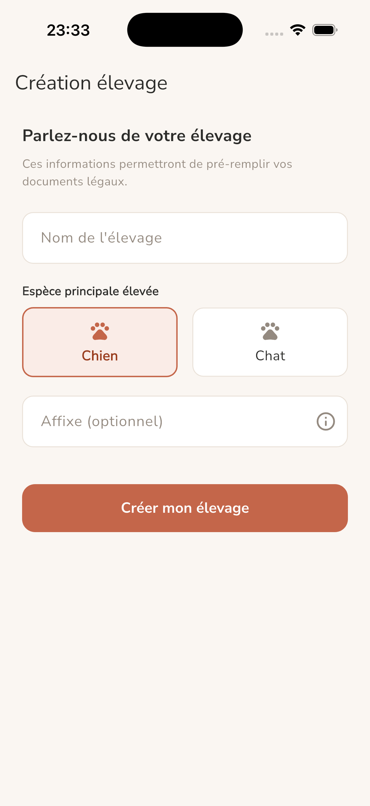
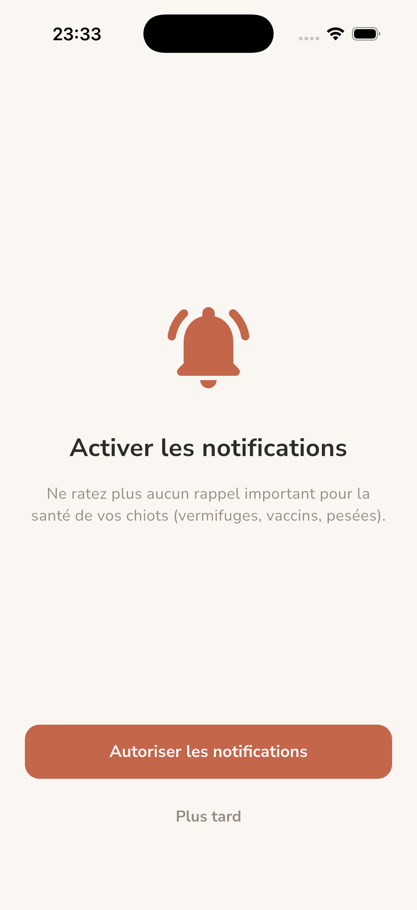
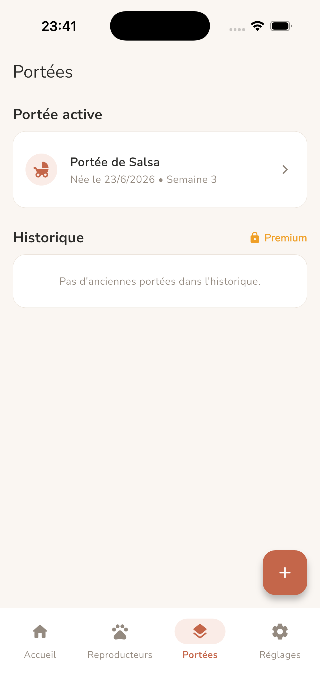
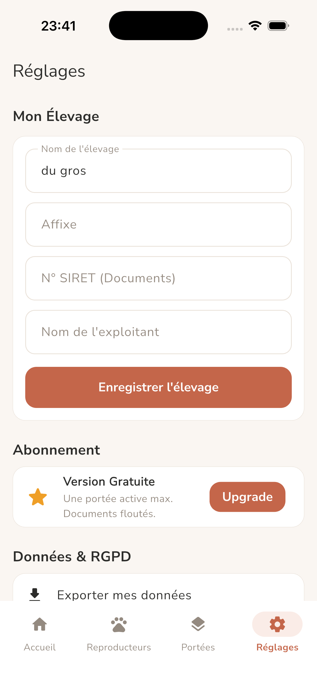
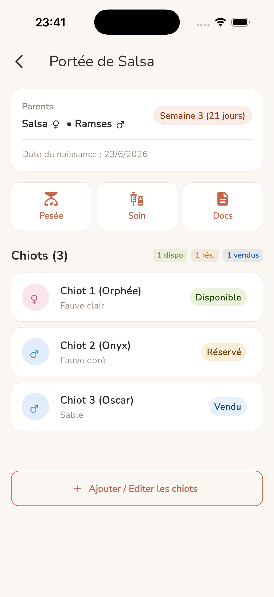
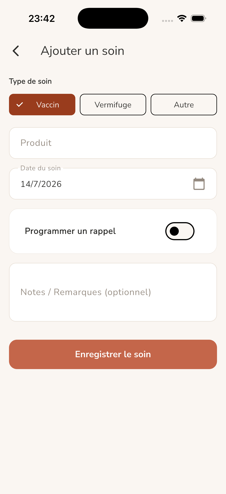
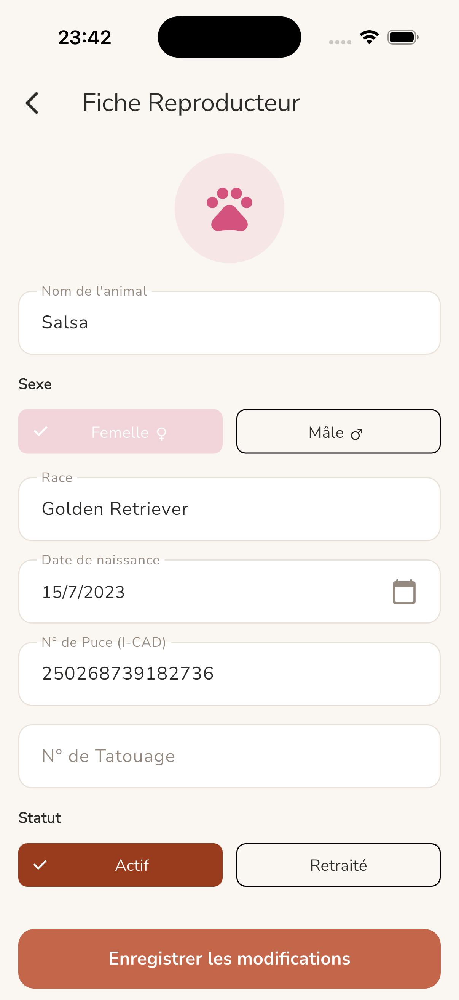
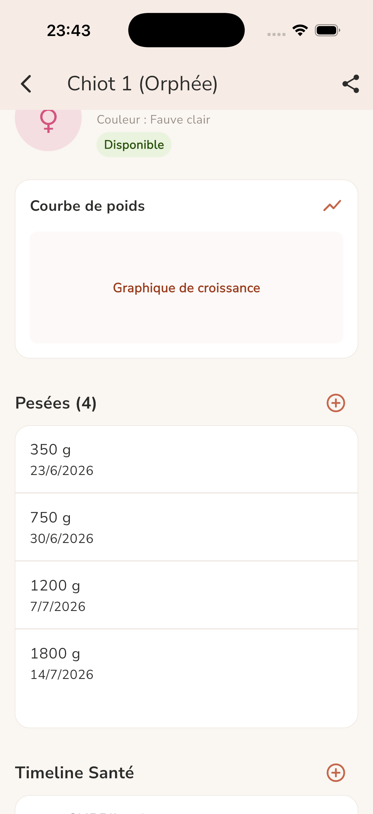
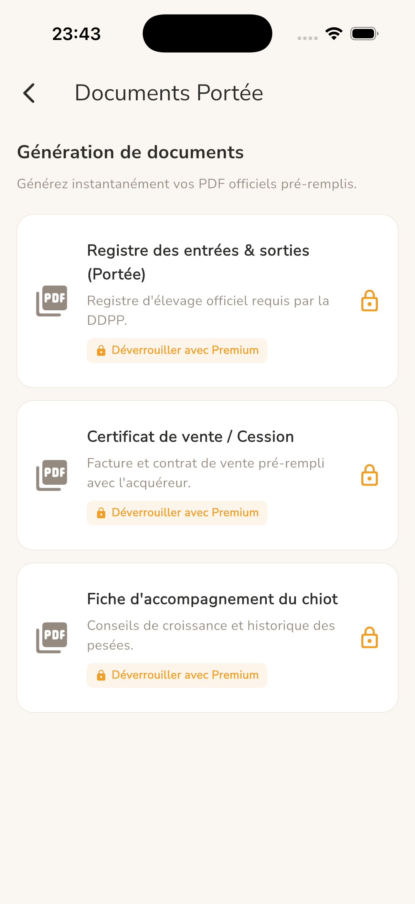

# 🐾 Portea Flutter Client

**Portea** est une application mobile de pointe conçue spécifiquement pour les éleveurs canins et félins professionnels. Elle simplifie et centralise l'ensemble de la gestion administrative, physiologique, généalogique et sanitaire de l'élevage au quotidien.

Ce dépôt contient l'application client **Flutter**, structurée selon les meilleurs standards de développement pour servir de démonstration technique et de portfolio de présentation.

---

## 🚀 Fonctionnalités Clés

* **Onboarding & Configuration** : Prise en main simple avec création de la fiche légale de l'élevage (Siret, Affixe, Espèce).
* **Tableau de Bord Dynamique** : Vue synthétique instantanée de l'activité, suivi de la portée en cours et rappels de soins imminents.
* **Registre des Reproducteurs** : Gestion complète des fiches reproducteurs (Pedigree, puce/tatouage, statut d'activité).
* **Déclaration de Portées (Généalogie)** : Liaison automatique des parents (mères/pères de l'élevage ou saillies extérieures) et archivage historique.
* **Suivi de Croissance (Pesées)** : Outil de pesée groupée rapide pour les chiots/chatons et calcul automatique de la courbe de poids.
* **Carnet de Santé & Traitements** : Planification et enregistrement des vaccins, vermifuges et autres soins (individuels ou collectifs pour toute la portée).
* **Gestion Premium & Documents** : Édition des attestations de cession officielles, certificats vétérinaires et fonctionnalités premium de l'application.

---

## 📱 Aperçu Visuel (Portfolio)

### 🔑 1. Onboarding & Authentification
| Welcome Screen | Configuration Élevage | Choix Notifications | Écran de Connexion |
| :---: | :---: | :---: | :---: |
|  |  |  |  |

### 📊 2. Tableau de Bord & Reproducteurs
| Dashboard Principal | Registre des Reproducteurs | Profil d'un Reproducteur |
| :---: | :---: | :---: |
|  |  |  |

### 🐕 3. Gestion des Portées & Chiots
| Historique des Portées | Détails de la Portée | Création de Chiots en Lot |
| :---: | :---: | :---: |
|  |  |  |

### 🩺 4. Soins, Pesées & Fiches Individuelles
| Pesée de Groupe | Fiche Chiot & Courbe | Ajouter un Soin |
| :---: | :---: | :---: |
|  |  |  |

### 💼 5. Premium, Documents & Fiches Alternatives
| Portea Premium | Coffre-fort Documents | Fiche Graphique alternative |
| :---: | :---: | :---: |
|  |  |  |

---

## 🛠️ Stack Technique

L'application est développée avec une architecture moderne assurant testabilité, performance et évolutivité :

* **Framework principal** : [Flutter](https://flutter.dev) (Dart) en version `^3.38.4`.
* **Architecture** : **Clean Architecture** (Séparation stricte entre les couches Data, Domain et Presentation) couplée au pattern **MVVM** (Model-View-ViewModel).
* **Gestion d'État & DI** : [Provider](https://pub.dev/packages/provider) pour l'injection de dépendances réactive et le cycle de vie des ViewModels.
* **Routage** : [GoRouter](https://pub.dev/packages/go_router) pour une gestion déclarative des routes, de la navigation par onglets (ShellRoute) et de la redirection automatique (notamment pour forcer l'onboarding).
* **Backend interopérable** : Intégration native avec le framework [Serverpod](https://serverpod.dev) (communication temps réel typée via WebSocket/HTTP, authentification et base de données PostgreSQL).
* **Base de données en démonstration** : Système de base de données Mock en mémoire (`MockDatabase`) pour permettre l'essai complet sans nécessiter de serveur backend actif.

---

## 🧪 Tests Unitaires et Qualité du Code

La fiabilité métier est garantie par une couverture de tests unitaires rigoureuse couvrant les repositories et les ViewModels :

* **Tests d'onboarding** : Validation de la création d'élevage et du workflow d'onboarding.
* **Tests de dashboard** : Vérification du chargement combiné des données (mères, chiots, alertes sanitaires).
* **Tests des reproducteurs et portées** : Validation des règles métiers liées à la généalogie, à l'inactivation des portées précédentes, etc.
* **Tests de croissance et soins** : Couverture complète des cinétiques de pesée et de l'administration collective des soins.

### Lancer la suite de tests :
```bash
flutter test
```
*Toutes les assertions (63 tests unitaires) sont vérifiées et passent avec succès.*
