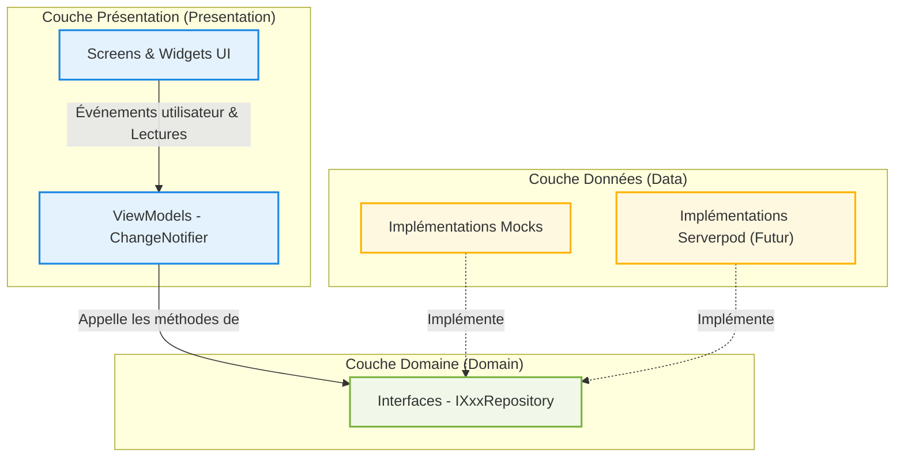
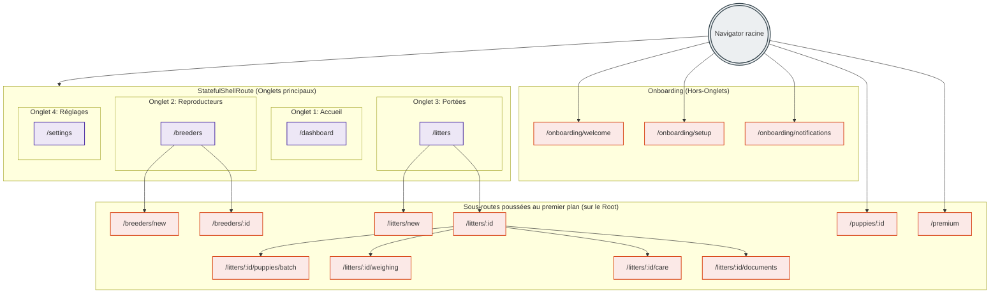
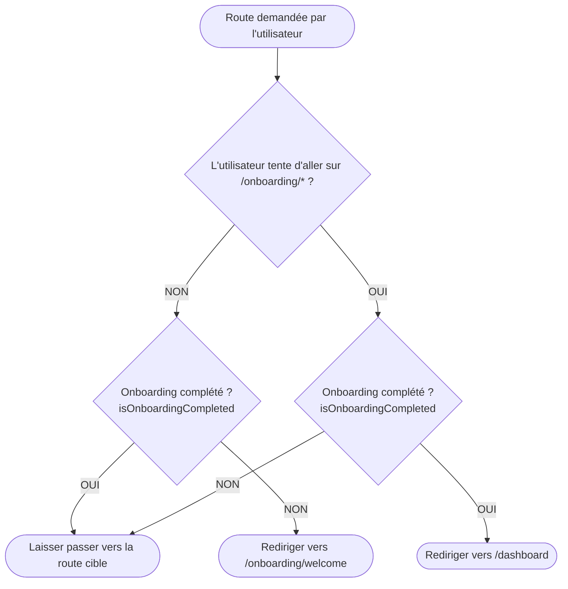
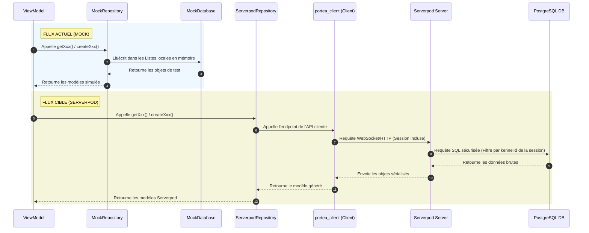

# Visualisation Technique — Portea Flutter

Ce document présente une cartographie complète et structurée de l'application **Portea Flutter**, basée sur l'audit statique et l'analyse de dépendances réalisée via l'outil `graphify` sur le codebase.

---

## 1. Architecture en couches par Feature

L'application respecte une **Clean Architecture en 3 couches** combinée avec le pattern de présentation **MVVM (Model-View-ViewModel)**. 

### Structure des 3 couches :
1. **Presentation** : Contient les Screens UI (Flutter Widgets) et les ViewModels (`ChangeNotifier`). Les ViewModels consomment les interfaces du Domain et notifient l'UI en cas de changement.
2. **Domain** : Contient la logique métier pure et les définitions d'interfaces de dépôt (`IXxxRepository`). *Note : Conformément aux règles absolues du projet, il n'y a pas de classes modèles côté app ; les entités de données proviennent exclusivement du client Serverpod généré.*
3. **Data** : Contient les implémentations des dépôts. Actuellement, toutes les implémentations actives sont des mocks (`MockXxxRepository`) s'interfaçant avec une base de données en mémoire locale (`MockDatabase`). À terme, elles seront remplacées par des implémentations Serverpod (`ServerpodXxxRepository`).

### Répartition par Feature

| Feature | Composants Présentation (UI & VM) | Interfaces Domaine | Implémentations Data (Actuel) |
| :--- | :--- | :--- | :--- |
| **F01 — Onboarding** | [OnboardingWelcomeScreen](file:///Users/cyril/dev/portea/portea_flutter/lib/features/onboarding/presentation/screens/onboarding_welcome_screen.dart) [SignInScreen](file:///Users/cyril/dev/portea/portea_flutter/lib/features/onboarding/presentation/screens/sign_in_screen.dart) *(à migrer)* [KennelSetupScreen](file:///Users/cyril/dev/portea/portea_flutter/lib/features/onboarding/presentation/screens/kennel_setup_screen.dart) [OnboardingNotificationsScreen](file:///Users/cyril/dev/portea/portea_flutter/lib/features/onboarding/presentation/screens/onboarding_notifications_screen.dart) [OnboardingViewModel](file:///Users/cyril/dev/portea/portea_flutter/lib/features/onboarding/presentation/view_models/onboarding_view_model.dart) | [IKennelRepository](file:///Users/cyril/dev/portea/portea_flutter/lib/features/onboarding/domain/repositories/i_kennel_repository.dart) | [MockKennelRepository](file:///Users/cyril/dev/portea/portea_flutter/lib/features/onboarding/data/repositories/mock_kennel_repository.dart) |
| **F02 — Reproducteurs** | [BreedersListScreen](file:///Users/cyril/dev/portea/portea_flutter/lib/features/breeders/presentation/screens/breeders_list_screen.dart) [BreederProfileScreen](file:///Users/cyril/dev/portea/portea_flutter/lib/features/breeders/presentation/screens/breeder_profile_screen.dart) [BreederListViewModel](file:///Users/cyril/dev/portea/portea_flutter/lib/features/breeders/presentation/view_models/breeder_list_view_model.dart) [BreederProfileViewModel](file:///Users/cyril/dev/portea/portea_flutter/lib/features/breeders/presentation/view_models/breeder_profile_view_model.dart) | [IBreederRepository](file:///Users/cyril/dev/portea/portea_flutter/lib/features/breeders/domain/repositories/i_breeder_repository.dart) | [MockBreederRepository](file:///Users/cyril/dev/portea/portea_flutter/lib/features/breeders/data/repositories/mock_breeder_repository.dart) |
| **F03 — Portées** | [LittersHistoryScreen](file:///Users/cyril/dev/portea/portea_flutter/lib/features/litters/presentation/screens/litters_history_screen.dart) [LitterDeclarationScreen](file:///Users/cyril/dev/portea/portea_flutter/lib/features/litters/presentation/screens/litter_declaration_screen.dart) [LitterDetailScreen](file:///Users/cyril/dev/portea/portea_flutter/lib/features/litters/presentation/screens/litter_detail_screen.dart) [LittersViewModel](file:///Users/cyril/dev/portea/portea_flutter/lib/features/litters/presentation/view_models/litters_view_model.dart) [LitterDeclarationViewModel](file:///Users/cyril/dev/portea/portea_flutter/lib/features/litters/presentation/view_models/litter_declaration_view_model.dart) [LitterDetailViewModel](file:///Users/cyril/dev/portea/portea_flutter/lib/features/litters/presentation/view_models/litter_detail_view_model.dart) | [ILitterRepository](file:///Users/cyril/dev/portea/portea_flutter/lib/features/litters/domain/repositories/i_litter_repository.dart) | [MockLitterRepository](file:///Users/cyril/dev/portea/portea_flutter/lib/features/litters/data/repositories/mock_litter_repository.dart) |
| **F04 à F08 — Chiots, Pesées & Soins** | [PuppyBatchCreationScreen](file:///Users/cyril/dev/portea/portea_flutter/lib/features/puppies/presentation/screens/puppy_batch_creation_screen.dart) [GroupWeighingScreen](file:///Users/cyril/dev/portea/portea_flutter/lib/features/puppies/presentation/screens/group_weighing_screen.dart) [PuppyFileScreen](file:///Users/cyril/dev/portea/portea_flutter/lib/features/puppies/presentation/screens/puppy_file_screen.dart) [AddCareScreen](file:///Users/cyril/dev/portea/portea_flutter/lib/features/puppies/presentation/screens/add_care_screen.dart) [PuppyBatchViewModel](file:///Users/cyril/dev/portea/portea_flutter/lib/features/puppies/presentation/view_models/puppy_batch_view_model.dart) [GroupWeighingViewModel](file:///Users/cyril/dev/portea/portea_flutter/lib/features/puppies/presentation/view_models/group_weighing_view_model.dart) [PuppyFileViewModel](file:///Users/cyril/dev/portea/portea_flutter/lib/features/puppies/presentation/view_models/puppy_file_view_model.dart) [AddCareViewModel](file:///Users/cyril/dev/portea/portea_flutter/lib/features/puppies/presentation/view_models/add_care_view_model.dart) | [IPuppyRepository](file:///Users/cyril/dev/portea/portea_flutter/lib/features/puppies/domain/repositories/i_puppy_repository.dart) [IWeighingRepository](file:///Users/cyril/dev/portea/portea_flutter/lib/features/puppies/domain/repositories/i_weighing_repository.dart) [ICareRepository](file:///Users/cyril/dev/portea/portea_flutter/lib/features/puppies/domain/repositories/i_care_repository.dart) | [MockPuppyRepository](file:///Users/cyril/dev/portea/portea_flutter/lib/features/puppies/data/repositories/mock_puppy_repository.dart) [MockWeighingRepository](file:///Users/cyril/dev/portea/portea_flutter/lib/features/puppies/data/repositories/mock_weighing_repository.dart) [MockCareRepository](file:///Users/cyril/dev/portea/portea_flutter/lib/features/puppies/data/repositories/mock_care_repository.dart) |
| **Dashboard** | [DashboardScreen](file:///Users/cyril/dev/portea/portea_flutter/lib/features/dashboard/presentation/screens/dashboard_screen.dart) [DashboardViewModel](file:///Users/cyril/dev/portea/portea_flutter/lib/features/dashboard/presentation/view_models/dashboard_view_model.dart) | *Pas de dépôt dédié* (consomme les autres interfaces) | *Pas de dépôt dédié* |
| **Settings & Premium (F09-F10)** | [SettingsScreen](file:///Users/cyril/dev/portea/portea_flutter/lib/features/settings/presentation/screens/settings_screen.dart) [DocumentsScreen](file:///Users/cyril/dev/portea/portea_flutter/lib/features/settings/presentation/screens/documents_screen.dart) [PorteaPremiumScreen](file:///Users/cyril/dev/portea/portea_flutter/lib/features/settings/presentation/screens/portea_premium_screen.dart) [SettingsViewModel](file:///Users/cyril/dev/portea/portea_flutter/lib/features/settings/presentation/view_models/settings_view_model.dart) | [ISettingsRepository](file:///Users/cyril/dev/portea/portea_flutter/lib/features/settings/domain/repositories/i_settings_repository.dart) | [MockSettingsRepository](file:///Users/cyril/dev/portea/portea_flutter/lib/features/settings/data/repositories/mock_settings_repository.dart) |

---

## 2. Graphe d'Injection de Dépendances (main.dart)

La résolution des dépendances de l'application est centralisée dans [main.dart](file:///Users/cyril/dev/portea/portea_flutter/lib/main.dart).
Elle utilise une structure de providers imbriqués (`MultiProvider`) organisée en deux étapes majeures :
1. **Enregistrement des Dépôts** (comme interfaces Domain via `Provider<IXxxRepository>.value`)
2. **Enregistrement des ViewModels** (via `ChangeNotifierProvider` pour l'onboarding et `ChangeNotifierProxyProvider` pour ceux qui dépendent des dépôts).

Voici le graphe d'injection actuel :

```mermaid
graph TD
    %% Instanciation brute
    subgraph Mocks ["Mocks Instanciés au démarrage"]
        M_Ken["MockKennelRepository"]
        M_Brd["MockBreederRepository"]
        M_Lit["MockLitterRepository"]
        M_Pup["MockPuppyRepository"]
        M_Wgh["MockWeighingRepository"]
        M_Car["MockCareRepository"]
        M_Set["MockSettingsRepository"]
    end

    %% Providers de Repositories
    subgraph RepoProviders ["Providers d'interfaces (Domain)"]
        P_Ken["Provider<IKennelRepository>"]
        P_Brd["Provider<IBreederRepository>"]
        P_Lit["Provider<ILitterRepository>"]
        P_Pup["Provider<IPuppyRepository>"]
        P_Wgh["Provider<IWeighingRepository>"]
        P_Car["Provider<ICareRepository>"]
        P_Set["Provider<ISettingsRepository>"]
    end

    %% Cablage Mocks -> Providers
    M_Ken --> P_Ken
    M_Brd --> P_Brd
    M_Lit --> P_Lit
    M_Pup --> P_Pup
    M_Wgh --> P_Wgh
    M_Car --> P_Car
    M_Set --> P_Set

    %% ViewModels
    subgraph ViewModels ["ViewModels (ChangeNotifier)"]
        VM_Onb["OnboardingViewModel"]
        VM_Dsh["DashboardViewModel"]
        VM_BrdLst["BreederListViewModel"]
        VM_BrdPrf["BreederProfileViewModel"]
        VM_LitLst["LittersViewModel"]
        VM_LitDet["LitterDetailViewModel"]
        VM_LitDec["LitterDeclarationViewModel"]
        VM_PupBtc["PuppyBatchViewModel"]
        VM_GrpWgh["GroupWeighingViewModel"]
        VM_PupFil["PuppyFileViewModel"]
        VM_AddCar["AddCareViewModel"]
        VM_Settings["SettingsViewModel"]
    end

    %% Injections dans les ViewModels (ProxyProviders)
    P_Ken -->|Injection| VM_Onb
    
    P_Ken & P_Lit & P_Pup & P_Car & P_Set -->|Proxy5| VM_Dsh
    P_Brd -->|Proxy| VM_BrdLst
    P_Brd -->|Proxy| VM_BrdPrf
    P_Lit & P_Set -->|Proxy2| VM_LitLst
    P_Lit & P_Brd & P_Pup -->|Proxy3| VM_LitDet
    P_Lit & P_Brd -->|Proxy2| VM_LitDec
    P_Pup -->|Proxy| VM_PupBtc
    P_Pup & P_Wgh -->|Proxy2| VM_GrpWgh
    P_Pup & P_Wgh & P_Car & P_Set -->|Proxy4| VM_PupFil
    P_Pup & P_Car -->|Proxy2| VM_AddCar
    P_Ken & P_Set -->|Proxy2| VM_Settings

    classDef repo fill:#e8f5e9,stroke:#2e7d32,stroke-width:1px;
    classDef prov fill:#e3f2fd,stroke:#1565c0,stroke-width:1.5px;
    classDef vmod fill:#fff3e0,stroke:#ef6c00,stroke-width:2px;
    
    class M_Ken,M_Brd,M_Lit,M_Pup,M_Wgh,M_Car,M_Set repo;
    class P_Ken,P_Brd,P_Lit,P_Pup,P_Wgh,P_Car,P_Set prov;
    class VM_Onb,VM_Dsh,VM_BrdLst,VM_BrdPrf,VM_LitLst,VM_LitDet,VM_LitDec,VM_PupBtc,VM_GrpWgh,VM_PupFil,VM_AddCar,VM_Settings vmod;
```

---

## 3. Carte de Navigation `go_router`

Le routage est structuré de façon déclarative dans [app_router.dart](file:///Users/cyril/dev/portea/portea_flutter/lib/core/routing/app_router.dart) avec un `StatefulShellRoute` pour l'interface principale à onglets, et des routes directes sur le root navigator pour les flux d'onboarding, de paywall et de fiches détaillées.

### Schéma global des Routes :

### Logique de Redirection (Guards) :

Au chargement de l'application et à chaque mise à jour du `OnboardingViewModel` (qui sert de `refreshListenable`), la fonction de redirection est appelée :

---

## 4. Flux de Données Actuel (Mock) vs Cible (Serverpod)

Le passage de la version actuelle (100% Mockée en mémoire) à la version de production nécessite de remplacer la source de données par le serveur Serverpod `portea_server`.

### Cartographie des endpoints Serverpod à créer (par feature)

| Feature | Méthode Repository Cible | Endpoint Serverpod à implémenter | Détails & Logique Métier Serveur |
| :--- | :--- | :--- | :--- |
| **F01 Onboarding** | `ServerpodKennelRepository` | `kennel` endpoint : - `getMyKennel()` : `Future<Kennel?>` - `createKennel(Kennel)` : `Future<Kennel>` | - Dérive l'ID utilisateur de la `Session` (jamais de paramètre client). - Garantit une relation 1:1 stricte entre l'utilisateur et l'élevage. - Résout si l'onboarding est complété en vérifiant si `getMyKennel()` retourne un élevage (non nul). Pas de flag de complétion dédié stocké en base. |
| **F02 Reproducteurs** | `ServerpodBreederRepository` | `breeder` endpoint : - `getBreeders()` : `Future<List<Breeder>>` - `getBreeder(id)` : `Future<Breeder>` - `createBreeder(Breeder)` : `Future<Breeder>` - `updateBreeder(Breeder)` : `Future<Breeder>` | - Filtrage systématique : `WHERE kennelId = session.kennel.id`. - Le sexe (`sex`) est figé lors de la création. - Un reproducteur `'retired'` est exclu des listes de sélection pour les futures portées. |
| **F03 Portées** | `ServerpodLitterRepository` | `litter` endpoint : - `getLitters()` : `Future<List<Litter>>` - `getActiveLitter()` : `Future<Litter?>` - `getLitter(id)` : `Future<Litter>` - `createLitter(Litter)` : `Future<Litter>` - `updateLitter(Litter)` : `Future<Litter>` | - **Contrôle Freemium** : Si l'utilisateur est gratuit et a déjà 1 portée active, renvoie une erreur métier bloquante lors de la création d'une nouvelle portée. - Filtrage par `kennelId` dérivé. |
| **F04 / F08 Chiots** | `ServerpodPuppyRepository` | `puppy` endpoint : - `getPuppies(litterId)` : `Future<List<Puppy>>` - `getPuppy(id)` : `Future<Puppy>` - `createPuppiesBatch(List<Puppy>)` : `Future<List<Puppy>>` - `updatePuppy(Puppy)` : `Future<Puppy>` | - La création en lot pré-remplit les lignes existantes si appel de mise à jour. - Validation : la portée (`litterId`) doit bien appartenir à l'élevage de l'utilisateur. - Les infos acquéreur sont stockées dans `Puppy` mais masquées dans l'UI si statut `'available'`. |
| **F05 Pesées** | `ServerpodWeighingRepository` | `weighing` endpoint : - `getWeighings(puppyId)` : `Future<List<WeighingEntry>>` - `addWeighings(List<WeighingEntry>)` : `Future<void>` | - Poids en grammes (`double`). - Validation d'appartenance du chiot à l'élevage de la session. - Trié chronologiquement sur le serveur. |
| **F06 / F07 Soins** | `ServerpodCareRepository` | `care` endpoint : - `getCareEntries(puppyId?, litterId?)` - `addCareEntry(CareEntry)` : `Future<CareEntry>` - `getUpcomingReminders(limit)` : `Future<List<CareEntry>>` | - Soin groupé : 1 entrée parent avec `litterId` (porte la date de rappel `reminderAt`) + N entrées enfants avec `puppyId` (`reminderAt` forcé à null pour éviter les doublons). - Les rappels sont persistés en base mais déclenchés localement par l'application (F07). |
| **F09 Documents** | `ServerpodDocumentRepository` | `document` endpoint : - `uploadCessionPdf(bytes, puppyId)` : `Future<String>` *(retourne l'URL)* - `getIssuedDocuments(puppyId)` : `Future<List<IssuedDocument>>` | - Upload de l'attestation de cession vers l'Object Storage Serverpod. - Enregistre l'historique dans la table `IssuedDocument`. |
| **F10 Premium** | `ServerpodSettingsRepository` | `webhooks` endpoint *(HTTP standard)* : - `POST /webhooks/revenuecat` | - Webhook appelé par RevenueCat pour mettre à jour la valeur `Kennel.premiumUntil` (date/heure). Le client ne fait jamais d'écriture directe sur le statut premium. |
